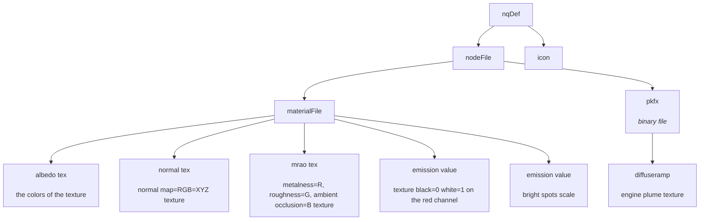

# MyDU Elements Mod

You need git LFS to download this repo.


# How does it work?



# Creating and Adding Skins to a Player

This project already have the nqdef files. All you need is adding the skin to the player.

Below is how you would extend this to create more skins.

* Create an nqdef that is a skin. Ie:

```json
{
    "elements": {
        "SpaceEngineXtraSmall_Epstein": {
            "inherit": "SpaceEngineXtraSmall",
            "node": "resources_generated/mods/com.github.VoidRunner87.mod_elements/spaceengine_xs_blue/env_engine-space-blue_001_xs.node",
            "icon": "resources_generated/elements/engines/engine-space-military_001_xs/icons/env_engine-space-military_001_xs_icon.png"
        }
    }
}
```
The file above reads as:
* `Epstein` skin name for `SpaceEngineXtraSmall` inherits all properties except `node` and `icon` from `SpaceEngineXtraSmall`

Then add the skin to the player:

* Find the number id of the element
* 
* Use that to set the skin
* 


# Disclaimer

This mod needs to copy a texture file to `vfxs/textures/` folder. However it does not override ANY existing files.

The mod adds a skin called "Epstein" to engines. You still need to go in the BO and add that skin to players.

## Install Client Side

Use the [mod manager](https://github.com/VoidRunner87/mydu_mod_manager)

* Grab a [release](../../releases) version and extract on `<MYDU_CLIENT>/mods-cache`
* Open the mod manager, refresh and install it

## Install Server Side

* Add the mod to the manifest of the server. See the mod_manager for how to.

## Roadmap

* More elements
