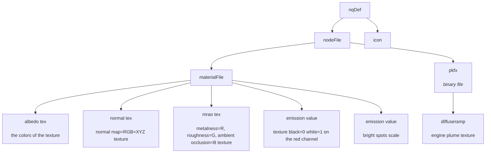

# MyDU Elements Mod

You need git LFS to download this repo.

# How does it work?

# Disclaimer

This mod needs to copy a texture file to `vfxs/textures/` folder. However it does not override ANY existing files.

The mod adds a skin called "Epstein" to engines. You still need to go in the BO and add that skin to players.

## Install Client Side

Use the [mod manager](https://github.com/VoidRunner87/mydu_mod_manager)

* Grab a [release](../../releases) version and extract on `<MYDU_CLIENT>/mods-cache`
* Open the mod manager, refresh and install it

## Install Server Side

* Add the mod to the manifest of the server. See the mod_manager for how to.

## Roadmap

* More elements
